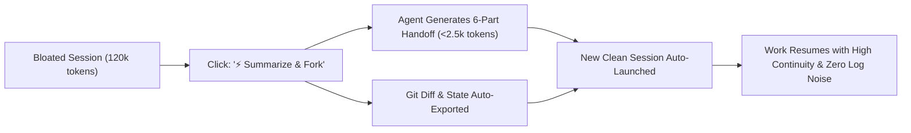

# ContextFork — Real-Time Context Observability & Native Session Forking Protocol (IPSF-1.2)
### A Clean-Break Handoff Specification for Long-Horizon Agentic LLM Conversations

[](https://opensource.org/licenses/MIT)
[](https://buymeacoffee.com/mrblackman)
[]()
[](contextfork.py)
[]()

**Author:** Mustafa KILINC ([@mrblackman](https://github.com/mrblackman))  
**Version:** IPSF-1.2 (Normative Protocol Specification)  
**Document ID:** `RFC-IPSF-001`  
**Repository:** [github.com/mrblackman/ContextFork](https://github.com/mrblackman/ContextFork)  

---

> 💡 **Core Principles:**  
> *"LLM summarizes; machines verify."*  
> *"Don't ask the AI to remember what the machine can verify."*

---

## 🎯 1. Executive Summary

Modern Large Language Models advertise theoretical context windows of 1M to 2M+ tokens. However, empirical research (Stanford's *Lost in the Middle*, Chroma's *MECW*, RULER) establishes that **effective reasoning accuracy for autonomous agentic coding degrades significantly as token contexts expand ("Context Rot")**. 

In extended engineering sessions (100–250+ steps), developers face two compounding bottlenecks:
1. **Zero Context Observability:** Users operate without real-time indicators for accumulated prompt tokens, tool output weight, or step counts. Sessions silently balloon past 100,000+ tokens, turning every routine prompt into a massive compute drain and triggering severe attention dilution.
2. **The "New Chat" Abstraction Failure:** The traditional "New Chat" button is a destructive reset. Developers resist starting fresh sessions because manually summarizing 50+ steps of architectural decisions, file modifications, and pending tasks creates severe handoff friction.

**ContextFork (IPSF-1.2)** formalizes an interoperable, vendor-agnostic protocol solving this dilemma through two core pillars:
1. **Ambient Context Telemetry:** Real-time UI visibility into active token count, step count, and attention degradation risk signals.
2. **Native "Summarize & Fork" (Session Forking):** A single-click handoff protocol that autonomously compresses a bloated session into a **verifiable 6-part handoff package**, launching a clean continuation session in the same workspace that **preserves the architectural decisions and working state captured by the handoff schema while achieving an immediate ~98% token reduction**.

---

## 💥 2. The Problem: "Context Rot" as an Attention Risk Signal

In transformer architectures, attention weights dilute over large token horizons. As prompt context grows:
* **Attention Dilution:** The attention matrix dilutes across historical terminal noise, failed tool attempts, and verbose build logs.
* **Repetitive Failure Looping:** Models begin treating their own past failed tool calls as "ground truth" or stylistic guidelines, falling into repetitive failure loops.
* **Loss of System Constraints:** High-priority system instructions (Constitutional rules, security isolation, git practices) placed at the beginning of the context fall into the "Lost in the Middle" trough.

> **Context Compression ≠ Context Preservation:**  
> Compressing 120,000 tokens into 2,000 tokens is inherently a lossy compression. If an agent summary omits *why* certain paths failed or lacks machine-verifiable evidence, the newly spawned child agent will repeat identical mistakes. True continuity requires pairing high-level LLM synthesis with deterministic working-tree state.

### Real-World Production Case Study:
During an active engineering and strategy session on an AI coding agent:
* **Step Count:** 226 steps
* **Transcript Size on Disk:** 408.13 KB
* **Accumulated Tokens:** **~119,400 tokens**

**The Cost of Inaction:**  
Even a simple user reply like *"Yes, proceed"* forces the model to ingest **119,400 tokens** before outputting a response, burning quota, spiking Time To First Token (TTFT), and multiplying hallucination risks.

---

## 📊 3. Feature 1: Real-Time Context Observability & Telemetry

AI coding environments must provide ambient, live feedback on the conversation's physical footprint.

### 3.1. UI Placement & Anatomy
Located on the status bar (adjacent to the model selector) or directly under assistant turns:

```text
[ 🟢 34.2k tokens | Step 28 | Normal ]
[ 🟡 68.5k tokens | Step 84 | Attention Risk Warning ]
[ 🔴 119.4k tokens | Step 226 | Context Rot Alert — Fork Recommended ]
```

### 3.2. Detailed Telemetry Inspector (Pop-over)
Clicking the badge exposes a diagnostic breakdown complying with [`context-telemetry.schema.json`](schemas/context-telemetry.schema.json):

```text
CONTEXT METRICS
────────────────────────────────────────────
Total Active Tokens:   119,400
├── Input / History:    78,200
├── Tool Outputs:       32,400
└── System Prompt:       8,800
Steps Executed:        226
Session Age:           2h 45m
Touched Files:         18 files
Failed Shell Commands: 4 (Handled)

RECOMMENDATION:
⚠️ Attention Dilution Risk Elevated
✓ Recommendation: Trigger "Summarize & Fork"
```

### 3.3. Configurable Policy & Reference Thresholds
Rather than hardcoded limits, ContextFork specifies configurable heuristic defaults via [`context-policy.schema.json`](schemas/context-policy.schema.json):

```json
{
  "context_policy": {
    "tokens": {
      "warning_threshold": 50000,
      "fork_recommended_threshold": 80000,
      "hard_limit": null
    },
    "steps": {
      "warning_threshold": 75,
      "fork_recommended_threshold": 120
    }
  }
}
```

| Token Range | Step Range | Risk Level | Indicator | Recommended Action |
| :--- | :--- | :--- | :--- | :--- |
| `< 50,000` | `< 75` | **Normal** | 🟢 Green badge | Standard operating range. Baseline attention density. |
| `50,000 - 80,000` | `75 - 120` | **Caution** | 🟡 Amber badge | Attention dilution risk elevated; avoid large log dumps. |
| `> 80,000` | `> 120` | **High Load** | 🔴 Red badge + alert | High attention dilution risk. Session checkpoint/fork recommended. |

---

## ⚡ 4. Feature 2: Native "Summarize & Fork" (The 6-Part Schema)

ContextFork transforms session restarts from a destructive wipe into an intelligent, verifiable checkpoint.

### 4.1. The Forking Workflow



### 4.2. The 6-Part Structured Handoff Schema
When triggered, a structured synthesis is generated complying with [`session-handoff.schema.json`](schemas/session-handoff.schema.json):

```markdown
# 🔄 Session Handoff Checkpoint (Forked from Session <ID>)

### 1. Active Goal & Scope
* Exact feature, bug, or architectural milestone being developed.
* Concrete acceptance criteria.

### 2. Settled Decisions, Tradeoffs & Evidence (Provenance)
* Accepted architectural choices and their rationale.
* Explicitly rejected alternatives (prevents re-debating).
* **Evidence:** File paths, commit hashes, or test results proving this decision (e.g. `src/Auth/JwtService.cs`, Commit `7ed9b80`).

### 3. Working Tree State & Machine Git Metadata
* **Git Status:** HEAD commit, current branch, clean/dirty state.
* **Modified Files:** Exact files created, modified, or deleted (`git diff HEAD --stat`).

### 4. Failed Approaches & Known Pitfalls (⚡ Anti-Loop Shield)
* What was attempted, what failed, and why it was abandoned.
* **Barred Action:** Explicit instruction prohibiting the child agent from retrying this failed approach.

### 5. Open Risks, Edge Cases & Unknowns
* Lingering technical risks, external dependencies, or unverified assumptions.

### 6. Immediate Next Action
* The single, atomic next command, test, or code edit to execute immediately.
```

---

## 🛡️ 5. Verifiable Handoff Package (Deterministic State)

A text-only LLM summary is vulnerable to omission or drift. Because `git diff HEAD` does NOT capture newly created, untracked files, ContextFork specifies a **Verifiable Handoff Package** complying with [`verifiable-package.schema.json`](schemas/verifiable-package.schema.json) persisted automatically on fork:

```text
.contextfork/
├── handoff_summary.md       # Synthesized 6-part markdown handoff (LLM intent)
├── git_status.json          # Untracked, staged, and modified files (Machine truth)
├── git_diff.patch           # Exact working-tree diff against parent HEAD (Staged + Unstaged)
├── untracked_manifest.json  # Manifest of untracked files (size, sha256)
├── untracked/               # Snapshots of new/untracked text files (<1MB)
└── session_metadata.json    # Parent ID, token counts, step duration, full commit SHA
```

When the child session initializes, it reads the synthesized markdown for intent, while anchoring its physical perception in the deterministic diff, status, and untracked file snapshots.

---

## 💻 6. Reference Implementation (`contextfork.py`)

ContextFork provides an official, zero-dependency reference CLI written in pure Python 3.10+ standard library. It executes deterministically on Windows, macOS, and Linux without requiring `pip install`:

```bash
# 1. Run live terminal telemetry and forking simulation
python contextfork.py demo

# 2. Inspect active repository and .contextfork package state
python contextfork.py status

# 3. Export a verifiable handoff package (capturing diff, status, and untracked files)
python contextfork.py export --session "session-123" --goal "Refactoring Auth Service"

# 4. Validate package integrity against IPSF-1.2 JSON schemas
python contextfork.py validate
```

---

## 📐 7. Formal Protocol Schemas (`schemas/`)

ContextFork provides formal JSON Schemas for tool authors and IDE vendors to implement interoperable context lifecycle management:

| Schema File | Purpose |
| :--- | :--- |
| **[`session-handoff.schema.json`](schemas/session-handoff.schema.json)** | Validates the 6-part handoff summary with evidence and provenance. |
| **[`context-policy.schema.json`](schemas/context-policy.schema.json)** | Defines configurable warning/fork token thresholds and step heuristics. |
| **[`context-telemetry.schema.json`](schemas/context-telemetry.schema.json)** | Validates the ambient context telemetry payload emitted to IDE UI. |
| **[`verifiable-package.schema.json`](schemas/verifiable-package.schema.json)** | Validates the structure and file manifests of the `.contextfork/` bundle. |

---

## 🧭 8. The Architecture: Agent Context System (ACS)

ContextFork operates within a unified three-tier **Agent Context & Efficiency Stack**:

```text
               ┌────────────────────────────────────────────────────────┐
               │         AGENT CONTEXT & EFFICIENCY STACK               │
               └────────────────────────────────────────────────────────┘
                                           │
         ┌─────────────────────────────────┼─────────────────────────────────┐
         ▼                                 ▼                                 ▼
   [ RETRIEVE ]                      [ MANAGE ]                        [ TRANSFER ]
  git-grep-first                    ContextFold                        ContextFork
  (Search Policy)            (Virtual Memory Paging)             (Session Handoff & Shaping)
  • Zero token bloat         • In-place folding                  • 6-part verifiable handoff
  • git grep --untracked     • UI side-drawers                   • Evidence & Git state
  • Anti-Select-String       • On-demand hydration               • Multi-agent context shaping
```

Beyond temporal continuity (Session A → Session B), ContextFork powers **role-based context shaping**, filtering parent context into specialized slices for subagents (Planner, Coder, Tester).

---

## 🔌 9. Potential Integration Surfaces

The specification is designed for modular adoption across multiple developer interface layers:

* **IDE Platforms (Antigravity, Cursor, Windsurf):**
  * Ambient status-bar badge for live context telemetry.
  * Toolbar action replacing destructive "New Chat" with "Fork Chat with Checkpoint".
  * Drawer panel showing verifiable `.contextfork/` artifacts.
* **CLI & Terminal Tools (Claude Code, Antigravity CLI, Aider):**
  * Native `/fork` or `--fork` commands to seed a clean child session thread from the current state.
* **Agent Orchestration Frameworks (LangChain, AutoGen, CrewAI):**
  * Context lifecycle middleware and session state provider for subagent context shaping.

---

## 🚀 10. Illustrative Benchmark & Impact

| Metric | Bloated Parent Session | Forked Child Session | Improvement |
| :--- | :--- | :--- | :--- |
| **Prompt Context Size** | 119,400 tokens | ~2,200 tokens | **98.2% Reduction** (Direct Math) |
| **TTFT (Latency)** | 12 – 18 seconds | < 1.2 seconds | **~12x Speedup** (Empirical) |
| **Per-Turn Cost / Quota** | ~120k tokens / turn | ~2.5k tokens / turn | **98% Cost Savings** (Direct Math) |
| **Attention Weight** | Diluted across 400KB logs | Focused on 6-Part Schema | **Reduces exposure to irrelevant history** |
| **Mistake Prevention** | Prone to repeating old errors | Guarded by *Failed Approaches* | **Eliminates Regressive Retries** |
| **Audit Trail** | Monolithic linear log | Parent tagged as `[Forked -> XYZ]` | **Verifiable Auditability** |

> **Note on Metrics:** Context and cost reductions (98.2%) are mathematical calculations based on token volume (119.4k → 2.2k). TTFT and latency speedups are empirical observations in our testing environment; actual latency and cost vary by model provider, caching architecture, network queue depth, and output length.

---

## ☕ Support

If the ContextFork specification helps your agentic workflows or inspires your tooling architecture, consider buying me a coffee!

[](https://buymeacoffee.com/mrblackman)

---

## 📜 11. License & Attribution

Released under the **[MIT License](LICENSE)**.

```bibtex
@misc{kilinc2026contextfork,
  author = {Mustafa KILINC (@mrblackman)},
  title = {ContextFork: Real-Time Context Observability and Native Session Forking Protocol (IPSF-1.2)},
  year = {2026},
  publisher = {GitHub},
  howpublished = {\url{https://github.com/mrblackman/ContextFork}}
}
```
