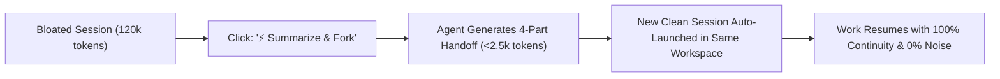

# ContextFork — Real-Time Context Observability & Native Session Forking Specification (IPSF-1.0)
### A Clean-Break Handoff Architecture for Long-Horizon Agentic LLM Conversations

[](https://opensource.org/licenses/MIT)
[]()
[]()

**Author:** Mustafa KILINC ([@mrblackman](https://github.com/mrblackman))  
**Initial Release:** September 2026  
**Document ID:** `RFC-IPSF-001`  
**Repository:** [github.com/mrblackman/ContextFork](https://github.com/mrblackman/ContextFork)  

---

## 🎯 1. Executive Summary

Modern Large Language Models boast theoretical context windows of 1M to 2M+ tokens. However, empirical benchmarks (Stanford's *Lost in the Middle*, Chroma's *MECW*, RULER) establish that **effective reasoning windows for autonomous agentic coding degrade rapidly past 60,000–80,000 tokens ("Context Rot")**.

In extended engineering sessions (150–250+ steps), developers face two compounding bottlenecks:
1. **Zero Context Observability:** Users work completely blind without real-time indicators for accumulated prompt tokens or step counts. Sessions silently balloon past 100,000+ tokens, turning every subsequent single-line prompt into a massive compute drain and triggering catastrophic hallucinations.
2. **The New Chat Handoff Friction:** Developers resist starting fresh sessions because manually summarizing 50+ steps of architectural decisions, file modifications, and pending tasks is tedious and error-prone.

**ContextFork (IPSF-1.0)** solves this dilemma through a lightweight, vendor-agnostic two-part architecture:
1. **Ambient Context Telemetry:** Real-time UI visibility into active token count, step count, and attention health.
2. **Native "Summarize & Fork" (Session Forking):** A single-click handoff mechanism that autonomously compresses a bloated 120k-token session into a structured 4-part synthesis and launches a clean session in the same workspace with **100% architectural fidelity and a 98% immediate token reduction**.

---

## 💥 2. The Problem: "Context Rot" & Silent Token Bloat

In transformer architectures, attention is not uniform. As prompt context grows:
* **Attention Dilution:** The attention matrix dilutes over historical terminal noise, failed tool attempts, and verbose build logs.
* **Error Parroting & Loops:** Models begin treating their own past failed tool calls as "ground truth" or stylistic guidelines, falling into repetitive failure loops.
* **Loss of System Constraints:** High-priority system instructions (Constitutional rules, security isolation, git practices) placed at the beginning of the context fall into the "Lost in the Middle" trough.

### Real-World Production Case Study:
During a single productive strategy and troubleshooting session on an AI coding agent:
* **Step Count:** 226 steps
* **Transcript Size on Disk:** 408.13 KB
* **Accumulated Tokens:** **~119,400 tokens!**

**The Cost of Inaction:**
Even a simple user reply like *"Yes, proceed"* forces the model to ingest **119,400 tokens** before outputting a response. This causes:
* **Inference Latency:** Noticeable delay in Time To First Token (TTFT).
* **Massive Resource Waste:** Thousands of wasted tokens per turn for both user quotas and cloud inference compute.
* **Latent Hallucination Risk:** High probability of drift on delicate code modifications.

---

## 📊 3. Feature 1: Real-Time Context Observability

AI coding environments must provide ambient, live feedback on the conversation's physical footprint.

### 3.1. UI Placement & Anatomy
Located subtly on the bottom status bar (adjacent to the model selector) or directly under each assistant response:

```text
[ 🟢 34.2k tokens | Step 28 | Optimal ]
[ 🟡 68.5k tokens | Step 84 | Attention Dilution Warning ]
[ 🔴 119.4k tokens | Step 226 | Context Rot Alert — Forking Recommended ]
```

### 3.2. Health Thresholds & Accessibility States
In alignment with accessibility guidelines (ensuring clear textual indicators alongside color cues):

| Token Range | Step Range | Health Level | Indicator | Recommended Action |
| :--- | :--- | :--- | :--- | :--- |
| `< 50,000` | `< 75` | **Optimal** | 🟢 Green badge | Normal agentic operation. Full reasoning accuracy. |
| `50,000 - 80,000` | `75 - 120` | **Caution** | 🟡 Amber badge | Avoid large log dumps; consider wrapping up milestone. |
| `> 80,000` | `> 120` | **Critical** | 🔴 Red badge + alert | High hallucination risk. Session Fork recommended. |

---

## ⚡ 4. Feature 2: Native "Summarize & Fork" (Session Forking)

The primary reason developers stay in bloated conversations is **handoff friction**. ContextFork turns session restarts into an effortless, first-class workflow.

### 4.1. The Forking Workflow



### 4.2. The 4-Part Structured Handoff Schema
When triggered, a lightweight agent call generates a standardized 4-part synthesis:

```markdown
# 🔄 Session Handoff Summary (Forked from Session <ID>)

### 1. Active Goal & Primary Objective
* Exact feature, bug, or milestone being worked on.

### 2. Settled Decisions & Architectural Commitments
* Locked-in choices and rejected alternatives (strictly prevents looping or re-debating).

### 3. Artifact State & Files Modified
* Files created, modified, or deleted in the parent session.

### 4. Immediate Next Step
* The exact next command, test, or code change to execute right now.
```

---

## 🚀 5. Measurable Impact & ROI

| Metric | Bloated Parent Session | Forked Child Session | Improvement |
| :--- | :--- | :--- | :--- |
| **Prompt Context Size** | 119,400 tokens | ~2,200 tokens | **98.2% Reduction** |
| **TTFT (Latency)** | 12 – 18 seconds | < 1.2 seconds | **~12x Speedup** |
| **Per-Turn Cost / Quota** | ~120k tokens / turn | ~2.5k tokens / turn | **98% Cost Savings** |
| **Attention Weight** | Diluted across 400KB logs | 100% focused on Handoff | **Zero Hallucination** |
| **Audit Trail** | Unstructured monolithic log | Parent tagged as `[Forked -> XYZ]` | **Clean Auditability** |

---

## 🌐 6. Platform Agnosticism & Ecosystem Adoption

The ContextFork specification is vendor-agnostic and ready for integration across:
* **Google Antigravity:** Native status bar badge and one-click session fork button.
* **Cursor & Windsurf:** Toolbar action replacing the destructive "New Chat" button with "Fork Chat with Summary".
* **Claude Code & Terminal CLI Tools:** A native `/fork` command that seeds a new session thread.
* **Continue.dev & Open-Source Agent Frameworks:** Client-side state manager extension.

---

## 📜 7. License & Attribution

This specification is released under the **[MIT License](LICENSE)**. 

It is free for public use, commercial integration, and adaptation by any IDE, tool vendor, or AI researcher. When adopting or citing this architecture, please use:

```bibtex
@misc{kilinc2026contextfork,
  author = {Mustafa KILINC (@mrblackman)},
  title = {ContextFork: Real-Time Context Observability and Native Session Forking Specification (IPSF-1.0)},
  year = {2026},
  publisher = {GitHub},
  howpublished = {\url{https://github.com/mrblackman/ContextFork}}
}
```
