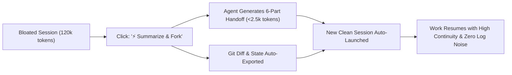
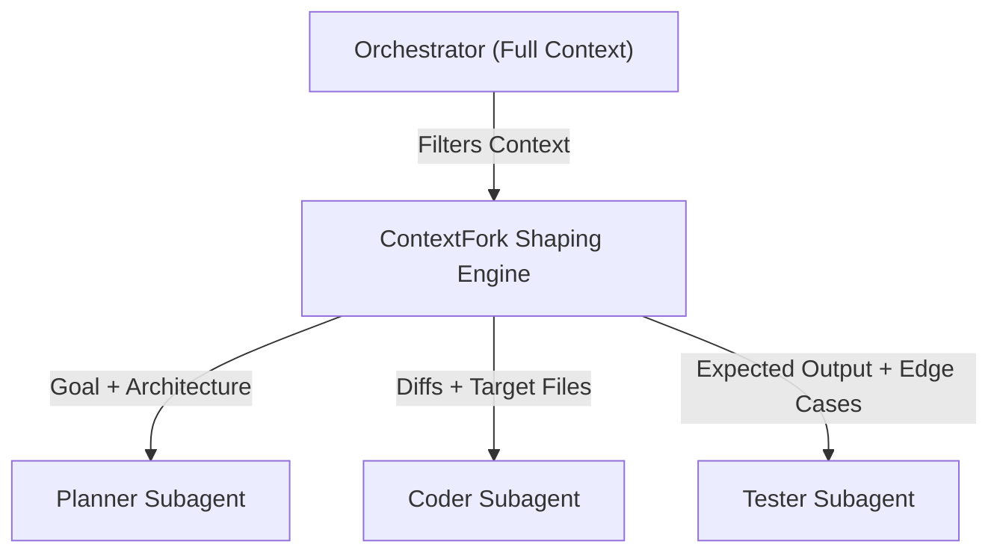

# ContextFork — Real-Time Context Observability & Native Session Forking Specification (IPSF-1.1)
### A Clean-Break Handoff Architecture for Long-Horizon Agentic LLM Conversations

[](https://opensource.org/licenses/MIT)
[](https://buymeacoffee.com/mrblackman)
[]()
[]()

**Author:** Mustafa KILINC ([@mrblackman](https://github.com/mrblackman))  
**Version:** IPSF-1.1 (Updated September 2026)  
**Document ID:** `RFC-IPSF-001`  
**Repository:** [github.com/mrblackman/ContextFork](https://github.com/mrblackman/ContextFork)  

---

## 🎯 1. Executive Summary

Modern Large Language Models boast theoretical context windows of 1M to 2M+ tokens. However, empirical benchmarks (Stanford's *Lost in the Middle*, Chroma's *MECW*, RULER) establish that **effective reasoning accuracy for autonomous agentic coding degrades significantly as token contexts expand ("Context Rot")**. 

In extended engineering sessions (100–250+ steps), developers face two compounding bottlenecks:
1. **Zero Context Observability:** Users work completely blind without real-time indicators for accumulated prompt tokens, tool output weight, or step counts. Sessions silently balloon past 100,000+ tokens, turning every routine prompt into a massive compute drain and triggering catastrophic attention dilution.
2. **The "New Chat" Abstraction Failure:** The traditional "New Chat" button is a destructive reset. Developers resist starting fresh sessions because manually summarizing 50+ steps of architectural decisions, file modifications, and pending tasks creates severe handoff friction.

**ContextFork (IPSF-1.1)** solves this dilemma through a lightweight, vendor-agnostic architecture:
1. **Ambient Context Telemetry:** Real-time UI visibility into active token count, step count, and attention degradation risk signals.
2. **Native "Summarize & Fork" (Session Forking):** A single-click handoff mechanism that autonomously compresses a bloated session into a **verifiable 6-part handoff package**, launching a clean continuation session in the same workspace with **high architectural continuity, deterministic ground truth, and a ~98% immediate token reduction**.

---

## 💥 2. The Problem: "Context Rot" as an Attention Risk Signal

In transformer architectures, attention is not uniform across large token horizons. As prompt context grows:
* **Attention Dilution:** The attention matrix dilutes over historical terminal noise, failed tool attempts, and verbose build logs.
* **Repetitive Failure Looping:** Models begin treating their own past failed tool calls as "ground truth" or stylistic guidelines, falling into repetitive failure loops.
* **Loss of System Constraints:** High-priority system instructions (Constitutional rules, security isolation, git practices) placed at the beginning of the context fall into the "Lost in the Middle" trough.

> **Context Compression ≠ Context Preservation:**  
> Compressing 120,000 tokens into 2,000 tokens is a lossy operation. If an agent summary omits *why* certain paths failed, the newly spawned child agent will repeat identical mistakes. True continuity requires pairing high-level LLM synthesis with verifiable state.

### Real-World Production Case Study:
During an active engineering and strategy session on an AI coding agent:
* **Step Count:** 226 steps
* **Transcript Size on Disk:** 408.13 KB
* **Accumulated Tokens:** **~119,400 tokens**

**The Cost of Inaction:**  
Even a simple user reply like *"Yes, proceed"* forces the model to ingest **119,400 tokens** before outputting a response, burning quota, spiking Time To First Token (TTFT), and multiplying hallucination risks.

---

## 📊 3. Feature 1: Real-Time Context Observability & Telemetry

AI coding environments must provide ambient, live feedback on the conversation's physical footprint.

### 3.1. UI Placement & Anatomy
Located subtly on the bottom status bar (adjacent to the model selector) or directly under each assistant response:

```text
[ 🟢 34.2k tokens | Step 28 | Optimal ]
[ 🟡 68.5k tokens | Step 84 | Attention Risk Warning ]
[ 🔴 119.4k tokens | Step 226 | Context Rot Alert — Fork Recommended ]
```

### 3.2. Detailed Telemetry Inspector (Pop-over)
Clicking the badge exposes a diagnostic breakdown:

```text
CONTEXT METRICS
────────────────────────────────────────────
Total Active Tokens:   119,400
├── Input / History:    78,200
├── Tool Outputs:       32,400
└── System Prompt:       8,800
Steps Executed:        226
Session Age:           2h 45m
Touched Files:         18 files
Failed Shell Commands: 4 (Handled)

RECOMMENDATION:
⚠️ Attention Dilution Risk Elevated
✓ Recommendation: Trigger "Summarize & Fork"
```

### 3.3. Attention Risk Thresholds
Token count acts as an **Attention Risk Signal** calibrated by transcript density:

| Token Range | Step Range | Risk Level | Indicator | Recommended Action |
| :--- | :--- | :--- | :--- | :--- |
| `< 50,000` | `< 75` | **Optimal** | 🟢 Green badge | Normal agentic operation. Full reasoning accuracy. |
| `50,000 - 80,000` | `75 - 120` | **Caution** | 🟡 Amber badge | Avoid large log dumps; prepare to wrap milestone. |
| `> 80,000` | `> 120` | **Critical** | 🔴 Red badge + alert | High attention dilution risk. Session Fork recommended. |

---

## ⚡ 4. Feature 2: Native "Summarize & Fork" (The 6-Part Schema)

ContextFork turns session restarts from a destructive wipe into an intelligent checkpoint.

### 4.1. The Forking Workflow



### 4.2. The 6-Part Structured Handoff Schema
When triggered, a structured synthesis is generated across 6 non-negotiable sections:

```markdown
# 🔄 Session Handoff Checkpoint (Forked from Session <ID>)

### 1. Active Goal & Scope
* Exact feature, bug, or architectural milestone being developed.

### 2. Settled Decisions & Tradeoffs
* Irreversible technical choices and architectural commitments made in the parent session.

### 3. Modified Files & Working Tree State
* Exact files created, edited, or deleted in the working directory.

### 4. Failed Approaches & Dead Ends (⚡ Anti-Loop Shield)
* What was attempted, why it failed, and what must NEVER be retried.
* Strictly prevents the child agent from repeating known mistakes.

### 5. Open Risks, Edge Cases & Unknowns
* Lingering technical risks, external dependencies, or unverified edge cases.

### 6. Immediate Next Action
* The single, atomic next command, test, or code edit to execute immediately.
```

---

## 🛡️ 5. Verifiable Handoff Package (Hybrid Synthesis)

A text-only LLM summary is vulnerable to omission or minor hallucinations. To guarantee true continuity, ContextFork specifies a **Verifiable Handoff Package** generated automatically on fork:

```text
.contextfork/
├── handoff_summary.md       # Synthesized 6-part markdown handoff
├── git_status.json          # Untracked, staged, and modified files
├── git_diff.patch           # Exact working-tree diff against parent HEAD
└── session_metadata.json    # Parent ID, token counts, step duration
```

When the child session initializes, it reads the synthesized markdown for intent, while anchoring its physical perception in the deterministic `git_diff.patch` and `git_status.json`. This provides **verifiable ground truth**.

---

## 🧭 6. The Next Evolution: Role-Based Context Shaping

While ContextFork primarily handles **temporal continuity** (Session A → Session B), its underlying schema naturally powers **multi-agent context shaping**:



By filtering the parent session's context into specialized slices, subagents remain lean, fast, and free of peripheral noise.

---

## 🚀 7. Measurable Impact & ROI

| Metric | Bloated Parent Session | Forked Child Session | Improvement |
| :--- | :--- | :--- | :--- |
| **Prompt Context Size** | 119,400 tokens | ~2,200 tokens | **98.2% Reduction** |
| **TTFT (Latency)** | 12 – 18 seconds | < 1.2 seconds | **~12x Speedup** |
| **Per-Turn Cost / Quota** | ~120k tokens / turn | ~2.5k tokens / turn | **98% Cost Savings** |
| **Attention Weight** | Diluted across 400KB logs | Focused on 6-Part Schema | **Eliminates Repetitive Loops** |
| **Mistake Prevention** | Prone to repeating old errors | Guarded by *Failed Approaches* | **Zero Regressive Retries** |
| **Audit Trail** | Monolithic linear log | Parent tagged as `[Forked -> XYZ]` | **Clean Verifiable History** |

---

## ☕ Support

If the ContextFork specification helps your agentic workflows or inspires your tooling architecture, consider buying me a coffee!

[](https://buymeacoffee.com/mrblackman)

---

## 📜 8. License & Attribution

Released under the **[MIT License](LICENSE)**.

```bibtex
@misc{kilinc2026contextfork,
  author = {Mustafa KILINC (@mrblackman)},
  title = {ContextFork: Real-Time Context Observability and Native Session Forking Specification (IPSF-1.1)},
  year = {2026},
  publisher = {GitHub},
  howpublished = {\url{https://github.com/mrblackman/ContextFork}}
}
```
